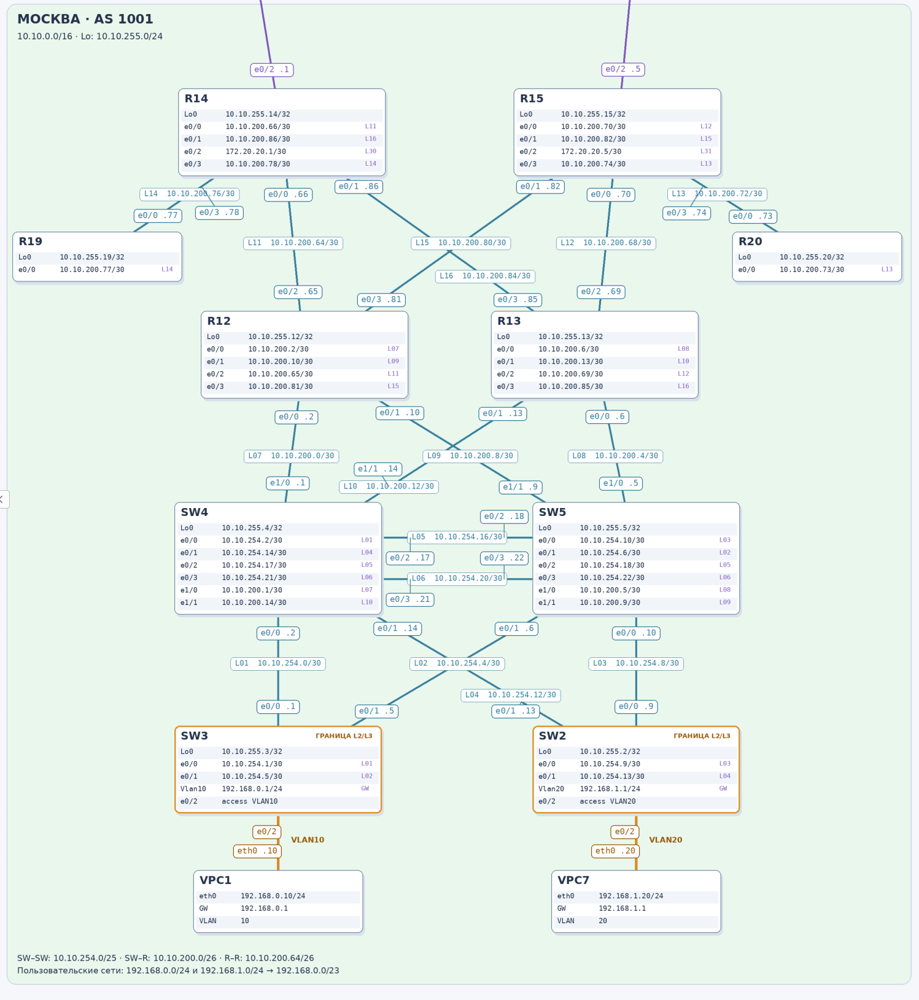

# Проектирование сети

## 1. Цель и условия работы

Спланировать адресное пространство, настроить IPv4-адреса на активных L3-интерфейсах и задокументировать адресацию стенда. Каждый VPC размещается в отдельном VLAN; для управления сетевыми устройствами используются Loopback или SVI управления. Для офисных сетей необходимо предусмотреть отсутствие L2-петель и эффективное использование соединений.

На L2 access- и trunk-портах отдельные IP-адреса не назначаются: IP находятся на VPC, SVI и подинтерфейсах маршрутизатора. В работе используется IPv4.

## 2. Общие правила адресации

- Каждой локации выделен инфраструктурный блок `10.N.0.0/16`. Это резерв адресного плана, а не единая подключённая подсеть.
- Loopback выделяются из `10.N.255.0/24`. Адрес устройства — `10.N.255.X/32`, где X соответствует числовой части hostname.
- Каждое отдельное внутреннее или межлокационное L3-соединение получает свою `/30` (маска `255.255.255.252`).
- Пользовательские подсети выделены отдельно из `192.168.x.x`, с маской `/24`.
- Межлокационные соединения используют общий пул `172.20.20.0/24`.
- Указание суммарного блока в документе не означает, что его объявление уже настроено.
- Распределение меньшего и большего адреса между концами линков задано таблицами; универсальное правило для всех линков не применяется.

### Общие блоки локаций

| Локация | Инфраструктурный блок | Пул Loopback | Пользовательский суммарный блок |
| --- | --- | --- | --- |
| Москва | `10.10.0.0/16` | `10.10.255.0/24` | `192.168.0.0/23` |
| Санкт-Петербург | `10.20.0.0/16` | `10.20.255.0/24` | `192.168.20.0/23` |
| Чокурдах | `10.30.0.0/16` | `10.30.255.0/24` | `192.168.30.0/23` |
| Лабытнанги | `10.40.0.0/16` | `10.40.255.0/24` | — |
| Триада | `10.50.0.0/16` | `10.50.255.0/24` | — |
| Ламас | `10.60.0.0/16` | `10.60.255.0/24` | — |
| Киторн | `10.70.0.0/16` | `10.70.255.0/24` | — |

Сеть управления SW29 `192.168.99.0/24` выделена отдельно и не входит в пользовательский суммарный блок Чокурдаха. Неиспользованные адреса инфраструктурных блоков остаются в резерве.

## 3. Москва

### 3.1. Пулы адресов

| Назначение | Пул | Использование |
| --- | --- | --- |
| SW–SW | `10.10.254.0/25` | 6 из 32 подсетей /30 |
| SW–R | `10.10.200.0/26` | 4 из 16 подсетей /30 |
| R–R | `10.10.200.64/26` | 6 из 16 подсетей /30 |
| Loopback | `10.10.255.0/24` | 10 адресов /32 |
| VLAN10 | `192.168.0.0/24` | VPC1 |
| VLAN20 | `192.168.1.0/24` | VPC7 |

Пулы SW–R и R–R вместе образуют `10.10.200.0/25`. Пользовательские подсети точно объединяются в `192.168.0.0/23`.

### 3.2. Соединения SW–SW

| Подсеть | Устройство A | Интерфейс A | IP A | Устройство B | Интерфейс B | IP B |
| --- | --- | --- | --- | --- | --- | --- |
| `10.10.254.0/30` | SW3 | Ethernet0/0 | `10.10.254.1/30` | SW4 | Ethernet0/0 | `10.10.254.2/30` |
| `10.10.254.4/30` | SW3 | Ethernet0/1 | `10.10.254.5/30` | SW5 | Ethernet0/1 | `10.10.254.6/30` |
| `10.10.254.8/30` | SW2 | Ethernet0/0 | `10.10.254.9/30` | SW5 | Ethernet0/0 | `10.10.254.10/30` |
| `10.10.254.12/30` | SW2 | Ethernet0/1 | `10.10.254.13/30` | SW4 | Ethernet0/1 | `10.10.254.14/30` |
| `10.10.254.16/30` | SW4 | Ethernet0/2 | `10.10.254.17/30` | SW5 | Ethernet0/2 | `10.10.254.18/30` |
| `10.10.254.20/30` | SW4 | Ethernet0/3 | `10.10.254.21/30` | SW5 | Ethernet0/3 | `10.10.254.22/30` |

### 3.3. Соединения SW–R

| Подсеть | Устройство A | Интерфейс A | IP A | Устройство B | Интерфейс B | IP B |
| --- | --- | --- | --- | --- | --- | --- |
| `10.10.200.0/30` | SW4 | Ethernet1/0 | `10.10.200.1/30` | R12 | Ethernet0/0 | `10.10.200.2/30` |
| `10.10.200.4/30` | SW5 | Ethernet1/0 | `10.10.200.5/30` | R13 | Ethernet0/0 | `10.10.200.6/30` |
| `10.10.200.8/30` | SW5 | Ethernet1/1 | `10.10.200.9/30` | R12 | Ethernet0/1 | `10.10.200.10/30` |
| `10.10.200.12/30` | SW4 | Ethernet1/1 | `10.10.200.13/30` | R13 | Ethernet0/1 | `10.10.200.14/30` |

### 3.4. Соединения R–R

| Подсеть | Устройство A | Интерфейс A | IP A | Устройство B | Интерфейс B | IP B |
| --- | --- | --- | --- | --- | --- | --- |
| `10.10.200.64/30` | R12 | Ethernet0/2 | `10.10.200.65/30` | R14 | Ethernet0/0 | `10.10.200.66/30` |
| `10.10.200.68/30` | R13 | Ethernet0/2 | `10.10.200.69/30` | R15 | Ethernet0/0 | `10.10.200.70/30` |
| `10.10.200.72/30` | R20 | Ethernet0/0 | `10.10.200.73/30` | R15 | Ethernet0/3 | `10.10.200.74/30` |
| `10.10.200.76/30` | R19 | Ethernet0/0 | `10.10.200.77/30` | R14 | Ethernet0/3 | `10.10.200.78/30` |
| `10.10.200.80/30` | R12 | Ethernet0/3 | `10.10.200.81/30` | R15 | Ethernet0/1 | `10.10.200.82/30` |
| `10.10.200.84/30` | R13 | Ethernet0/3 | `10.10.200.85/30` | R14 | Ethernet0/1 | `10.10.200.86/30` |

### 3.5. Пользовательские сети

| VPC | IP VPC | VLAN | Порт коммутатора | SVI шлюза | IP шлюза |
| --- | --- | --- | --- | --- | --- |
| VPC1 | `192.168.0.10/24` | 10 | SW3 Ethernet0/2 | SW3 Vlan10 | `192.168.0.1/24` |
| VPC7 | `192.168.1.20/24` | 20 | SW2 Ethernet0/2 | SW2 Vlan20 | `192.168.1.1/24` |

### 3.6. Loopback

| Устройство | Интерфейс | IP-адрес |
| --- | --- | --- |
| SW2 | Loopback0 | `10.10.255.2/32` |
| SW3 | Loopback0 | `10.10.255.3/32` |
| SW4 | Loopback0 | `10.10.255.4/32` |
| SW5 | Loopback0 | `10.10.255.5/32` |
| R12 | Loopback0 | `10.10.255.12/32` |
| R13 | Loopback0 | `10.10.255.13/32` |
| R14 | Loopback0 | `10.10.255.14/32` |
| R15 | Loopback0 | `10.10.255.15/32` |
| R19 | Loopback0 | `10.10.255.19/32` |
| R20 | Loopback0 | `10.10.255.20/32` |

### 3.7. Граница L2/L3 и обоснование

Граница L2/L3 находится на коммутаторах доступа SW3 и SW2. Шлюз VPC1 размещён на SVI Vlan10 SW3, шлюз VPC7 — на SVI Vlan20 SW2. Пользовательские широковещательные домены ограничены соответствующими VLAN на уровне доступа.

Выше этой границы будут использоваться маршрутизируемые соединения SW–SW, SW–R и R–R. Пользовательские VLAN по этим линкам не продлеваются. Два соединения SW4–SW5 будут использоваться как отдельные L3-линки с разными /30, без необходимости блокировать один из них протоколом STP. Это исключает L2-петли на этих соединениях. Резервирование путей и, при равной стоимости и поддержке ECMP, балансировка будут обеспечиваться после настройки маршрутизации. Само назначение адресов ещё не обеспечивает эти функции.

### 3.8. Схема

<b>Схема сети (Москва)</b>

 

[]

## 4. Санкт-Петербург

### 4.1. Пулы адресов

| Назначение | Пул | Использование |
| --- | --- | --- |
| SW–SW | `10.20.254.0/25` * | 2 из 32 подсетей /30 |
| SW–R | `10.20.200.0/26` * | 4 из 16 подсетей /30 |
| R–R | `10.20.200.64/26` * | 3 из 16 подсетей /30 |
| Loopback | `10.20.255.0/24` | 6 адресов /32 |
| VLAN10 | `192.168.20.0/24` | VPC8 |
| VLAN20 | `192.168.21.0/24` | VPC |

* Размеры родительских пулов /25 и /26 указаны по аналогии с Москвой и требуют подтверждения. Все конкретные /30 ниже согласованы. При таком делении пулы SW–R и R–R составляют `10.20.200.0/25`.

### 4.2. Соединения SW–SW

| Подсеть | Устройство A | Интерфейс A | IP A | Устройство B | Интерфейс B | IP B |
| --- | --- | --- | --- | --- | --- | --- |
| `10.20.254.0/30` | SW9 | Ethernet0/0 | `10.20.254.1/30` | SW10 | Ethernet0/0 | `10.20.254.2/30` |
| `10.20.254.4/30` | SW9 | Ethernet0/1 | `10.20.254.5/30` | SW10 | Ethernet0/1 | `10.20.254.6/30` |

### 4.3. Соединения SW–R

| Подсеть | Устройство A | Интерфейс A | IP A | Устройство B | Интерфейс B | IP B |
| --- | --- | --- | --- | --- | --- | --- |
| `10.20.200.0/30` | SW9 | Ethernet0/3 | `10.20.200.1/30` | R17 | Ethernet0/0 | `10.20.200.2/30` |
| `10.20.200.4/30` | SW10 | Ethernet0/3 | `10.20.200.5/30` | R16 | Ethernet0/0 | `10.20.200.6/30` |
| `10.20.200.8/30` | SW9 | Ethernet1/0 | `10.20.200.9/30` | R16 | Ethernet0/2 | `10.20.200.10/30` |
| `10.20.200.12/30` | SW10 | Ethernet1/0 | `10.20.200.13/30` | R17 | Ethernet0/2 | `10.20.200.14/30` |

### 4.4. Соединения R–R

| Подсеть | Устройство A | Интерфейс A | IP A | Устройство B | Интерфейс B | IP B |
| --- | --- | --- | --- | --- | --- | --- |
| `10.20.200.64/30` | R17 | Ethernet0/1 | `10.20.200.65/30` | R18 | Ethernet0/1 | `10.20.200.66/30` |
| `10.20.200.68/30` | R16 | Ethernet0/1 | `10.20.200.69/30` | R18 | Ethernet0/0 | `10.20.200.70/30` |
| `10.20.200.72/30` | R32 | Ethernet0/0 | `10.20.200.73/30` | R16 | Ethernet0/3 | `10.20.200.74/30` |

### 4.5. Пользовательские сети

| VPC | IP VPC | VLAN | Порт коммутатора | SVI шлюза | IP шлюза |
| --- | --- | --- | --- | --- | --- |
| VPC8 | `192.168.20.20/24` | 10 | SW9 Ethernet0/2 | SW9 Vlan10 | `192.168.20.1/24` |
| VPC | `192.168.21.21/24` | 20 | SW10 Ethernet0/2 | SW10 Vlan20 | `192.168.21.1/24` |

Имя второго узла сохранено как на схеме — VPC. Пользовательский суммарный блок — `192.168.20.0/23`.

### 4.6. Loopback

| Устройство | Интерфейс | IP-адрес |
| --- | --- | --- |
| SW9 | Loopback0 | `10.20.255.9/32` |
| SW10 | Loopback0 | `10.20.255.10/32` |
| R16 | Loopback0 | `10.20.255.16/32` |
| R17 | Loopback0 | `10.20.255.17/32` |
| R18 | Loopback0 | `10.20.255.18/32` |
| R32 | Loopback0 | `10.20.255.32/32` |

### 4.7. Граница L2/L3 и обоснование

Граница L2/L3 находится на SW9 и SW10. Пользовательские VLAN завершаются на SVI этих коммутаторов; далее будут использоваться маршрутизируемые соединения.

Между SW9 и SW10 будут использоваться два отдельных L3-соединения. Это позволит исключить L2-петли на этих линках и использовать оба соединения без блокировки одного из них протоколом STP. После настройки маршрутизации они обеспечат резервирование, а при равной стоимости путей и поддержке ECMP — балансировку трафика. Двойные подключения коммутаторов к маршрутизаторам также создают альтернативные пути.

### 4.8. Схема

<b>Схема сети (Санкт-Петербург)</b>

 

[]

## 5. Чокурдах

Локация состоит из R28, SW29, VPC30 и VPC31. Каждый VPC размещён в отдельном VLAN.

### 5.1. Адресные блоки

| Назначение | Блок / подсеть | Комментарий |
| --- | --- | --- |
| Инфраструктура | `10.30.0.0/16` | Пока используется только Loopback R28 |
| Loopback | `10.30.255.0/24` | На интерфейсе /32 |
| VLAN10 | `192.168.30.0/24` | VPC30 |
| VLAN20 | `192.168.31.0/24` | VPC31 |
| Сумма пользовательских сетей | `192.168.30.0/23` | Для адресного плана |
| Управление VLAN99 | `192.168.99.0/24` | SW29 |

Внутренние пулы SW–SW, SW–R и R–R не выделяются. SW29–R28 — L2-транк, которому отдельная P2P-подсеть не требуется.

### 5.2. Адреса устройств

| Устройство | Интерфейс | VLAN | IP-адрес | Шлюз по умолчанию |
| --- | --- | --- | --- | --- |
| R28 | Loopback0 | — | `10.30.255.28/32` | — |
| R28 | Ethernet0/2.10 | 10 | `192.168.30.1/24` | — |
| R28 | Ethernet0/2.20 | 20 | `192.168.31.1/24` | — |
| R28 | Ethernet0/2.99 | 99 | `192.168.99.1/24` | — |
| SW29 | Vlan99 | 99 | `192.168.99.29/24` | `192.168.99.1` * |
| VPC30 | eth0 | 10 | `192.168.30.30/24` | `192.168.30.1` |
| VPC31 | eth0 | 20 | `192.168.31.31/24` | `192.168.31.1` |

* Для SW29 указан необходимый шлюз управления; фактическую настройку нужно сверить с конфигурацией.

### 5.3. Подключения

| Порт SW29 | Сосед / интерфейс | Режим | VLAN |
| --- | --- | --- | --- |
| Ethernet0/0 | VPC30 / eth0 | Access | 10 |
| Ethernet0/1 | VPC31 / eth0 | Access | 20 |
| Ethernet0/2 | R28 / Ethernet0/2 | Trunk 802.1Q | 10, 20, 99 |

### 5.4. Граница L2/L3 и обоснование

Граница L2/L3 находится на R28. SW29 выполняет коммутацию внутри VLAN и передаёт VLAN10, VLAN20 и VLAN99 по транку 802.1Q к маршрутизатору. Шлюзы трёх подсетей размещены на подинтерфейсах R28 — схема Router-on-a-Stick. Она позволяет обслуживать несколько VLAN через один физический линк.

Отдельный IP-адрес на физическом Ethernet0/2 R28 не назначается. Подинтерфейсы .10, .20 и .99 обслуживают соответствующие VLAN. SVI Vlan99 SW29 используется для управления самим коммутатором.

Для дальнейшей связи с другими локациями будут использоваться маршрутизируемые соединения R28. Их адреса приведены в общей таблице межлокационных соединений.

Внутри локации отсутствует замкнутый L2-контур: SW29 подключён к R28 одним линком. VLAN разделяют широковещательные домены, но сами по себе не предотвращают любой возможный broadcast-шторм. Резервирование линка SW29–R28 не предусмотрено: при его отказе оба VPC потеряют доступ к своим шлюзам. Два внешних подключения R28 создают возможность резервирования внешних путей после настройки маршрутизации.

## 6. Триада

В локации четыре маршрутизатора: R23, R24, R25 и R26. Пользовательских сегментов и коммутаторов на схеме нет.

### 6.1. Пулы адресов

| Назначение | Пул | Использование |
| --- | --- | --- |
| Инфраструктура | `10.50.0.0/16` | Общий резерв локации |
| R–R | `10.50.200.64/26` | 4 из 16 подсетей /30 |
| Loopback | `10.50.255.0/24` | 4 адреса /32 |

### 6.2. Внутренние соединения

| Подсеть | Устройство A | Интерфейс A | IP A | Устройство B | Интерфейс B | IP B |
| --- | --- | --- | --- | --- | --- | --- |
| `10.50.200.64/30` | R24 | Ethernet0/1 | `10.50.200.66/30` | R26 | Ethernet0/0 | `10.50.200.65/30` |
| `10.50.200.68/30` | R26 | Ethernet0/2 | `10.50.200.69/30` | R25 | Ethernet0/2 | `10.50.200.70/30` |
| `10.50.200.72/30` | R23 | Ethernet0/2 | `10.50.200.73/30` | R24 | Ethernet0/2 | `10.50.200.74/30` |
| `10.50.200.76/30` | R23 | Ethernet0/1 | `10.50.200.77/30` | R25 | Ethernet0/0 | `10.50.200.78/30` |

### 6.3. Loopback

| Устройство | Интерфейс | IP-адрес |
| --- | --- | --- |
| R23 | Loopback0 | `10.50.255.23/32` |
| R24 | Loopback0 | `10.50.255.24/32` |
| R25 | Loopback0 | `10.50.255.25/32` |
| R26 | Loopback0 | `10.50.255.26/32` |

Во внутренних соединениях Триады будут использоваться отдельные маршрутизируемые /30. Общий L2-домен между четырьмя маршрутизаторами не создаётся. Топология предоставляет альтернативные пути, которые можно задействовать дальнейшей настройкой маршрутизации.

## 7. Лабытнанги, Ламас и Киторн

В каждой из этих локаций находится один маршрутизатор. Внутренних P2P-соединений и пользовательских сегментов нет. За локациями сохраняются отдельные /16 для единообразия и расширения; сейчас из них используются только Loopback. Внешние интерфейсы адресуются из межлокационного пула.

| Локация | Блок | Устройство | Интерфейс | IP |
| --- | --- | --- | --- | --- |
| Лабытнанги | `10.40.0.0/16` | R27 | Loopback0 | `10.40.255.27/32` |
| Ламас | `10.60.0.0/16` | R21 | Loopback0 | `10.60.255.21/32` |
| Киторн | `10.70.0.0/16` | R22 | Loopback0 | `10.70.255.22/32` |

## 8. Межлокационные соединения

Общий пул — `172.20.20.0/24`. Используются 10 из 64 возможных /30. Каждое соединение записано один раз, поскольку относится сразу к двум локациям.

| Подсеть | Локация A | Устройство / интерфейс A | IP A | Локация B | Устройство / интерфейс B | IP B |
| --- | --- | --- | --- | --- | --- | --- |
| `172.20.20.0/30` | Москва | R14 / Ethernet0/2 | `172.20.20.1/30` | Киторн | R22 / Ethernet0/0 | `172.20.20.2/30` |
| `172.20.20.4/30` | Москва | R15 / Ethernet0/2 | `172.20.20.5/30` | Ламас | R21 / Ethernet0/0 | `172.20.20.6/30` |
| `172.20.20.8/30` | Санкт-Петербург | R18 / Ethernet0/2 | `172.20.20.9/30` | Триада | R24 / Ethernet0/3 | `172.20.20.10/30` |
| `172.20.20.12/30` | Санкт-Петербург | R18 / Ethernet0/3 | `172.20.20.13/30` | Триада | R26 / Ethernet0/3 | `172.20.20.14/30` |
| `172.20.20.16/30` | Киторн | R22 / Ethernet0/2 | `172.20.20.17/30` | Триада | R23 / Ethernet0/0 | `172.20.20.18/30` |
| `172.20.20.20/30` | Ламас | R21 / Ethernet0/2 | `172.20.20.21/30` | Триада | R24 / Ethernet0/0 | `172.20.20.22/30` |
| `172.20.20.24/30` | Ламас | R21 / Ethernet0/1 | `172.20.20.25/30` | Киторн | R22 / Ethernet0/1 | `172.20.20.26/30` |
| `172.20.20.28/30` | Триада | R26 / Ethernet0/1 | `172.20.20.29/30` | Чокурдах | R28 / Ethernet0/0 | `172.20.20.30/30` |
| `172.20.20.32/30` | Триада | R25 / Ethernet0/3 | `172.20.20.33/30` | Чокурдах | R28 / Ethernet0/1 | `172.20.20.34/30` |
| `172.20.20.36/30` | Триада | R25 / Ethernet0/1 | `172.20.20.37/30` | Лабытнанги | R27 / Ethernet0/0 | `172.20.20.38/30` |

## 9. Сводка границ L2/L3

| Локация | Граница / роль | Обоснование |
| --- | --- | --- |
| Москва | SVI на SW3 и SW2 | Шлюзы на доступе; выше будут использоваться отдельные L3-соединения |
| Санкт-Петербург | SVI на SW9 и SW10 | Шлюзы на доступе; два линка SW9–SW10 будут использоваться как L3 |
| Чокурдах | Подинтерфейсы R28 | SW29 работает на L2; VLAN передаются по транку до шлюзов R28 |
| Триада | L3-интерфейсы маршрутизаторов | Пользовательских L2-сегментов нет |
| Лабытнанги, Ламас, Киторн | L3-интерфейсы маршрутизаторов | Только Loopback и межлокационные соединения |

## 10. Проверка и доработка черновика

В таблицах заполнены 39 P2P-подсетей /30: 16 внутренних линков Москвы, 9 Санкт-Петербурга, 4 Триады и 10 межлокационных. Также перечислены 24 Loopback, 6 пользовательских устройств и SVI управления SW29.

Перед финальной сдачей:

- [ ] Сверить физические интерфейсы и IP с конфигурациями, особенно порядок двух адресов на линках, где он был принят по расположению устройств на схеме.
- [ ] Подтвердить размеры родительских пулов Санкт-Петербурга, отмеченные звёздочкой.
- [ ] Проверить шлюз управления SW29 `192.168.99.1`.
- [ ] Сверить все Loopback и маски /32 с конфигурациями.
- [ ] Проверить доступность соседей на каждом /30 и шлюза с каждого VPC; добавить фактические результаты.
- [ ] Проверить access-порты, VLAN и транк SW29–R28; сохранить конфигурации устройств.
- [ ] Добавить итоговую схему с адресами и обозначенными границами L2/L3.

Результаты ping и выводы оборудования пока не приложены. Сквозная достижимость удалённых подсетей, резервирование и балансировка не считаются подтверждёнными только на основании адресного плана.

### Команды для последующей сверки

| Где | Команда | Назначение |
| --- | --- | --- |
| Cisco IOS | `show ip interface brief` | Показать адреса и состояние интерфейсов; маски сверять по конфигурации |
| Cisco IOS | `show running-config` | Сверить IP, маски, VLAN, подинтерфейсы и шлюз управления |
| Cisco IOS | `show ip route` | Проверить подключённые и остальные установленные маршруты |
| SW29 | `show interfaces trunk` | Проверить рабочий транк и разрешённые VLAN |
| Коммутатор | `show vlan brief` | Проверить VLAN и access-порты |
| Cisco IOS / VPCS | `ping <IP>` | Проверить достижимость выбранного соседа или шлюза |
| VPCS | `show ip` | Проверить IP, маску и шлюз VPC |
| Cisco IOS | `copy running-config startup-config` | Сохранить текущую конфигурацию |
| VPCS | `save` | Сохранить настройки VPC |
